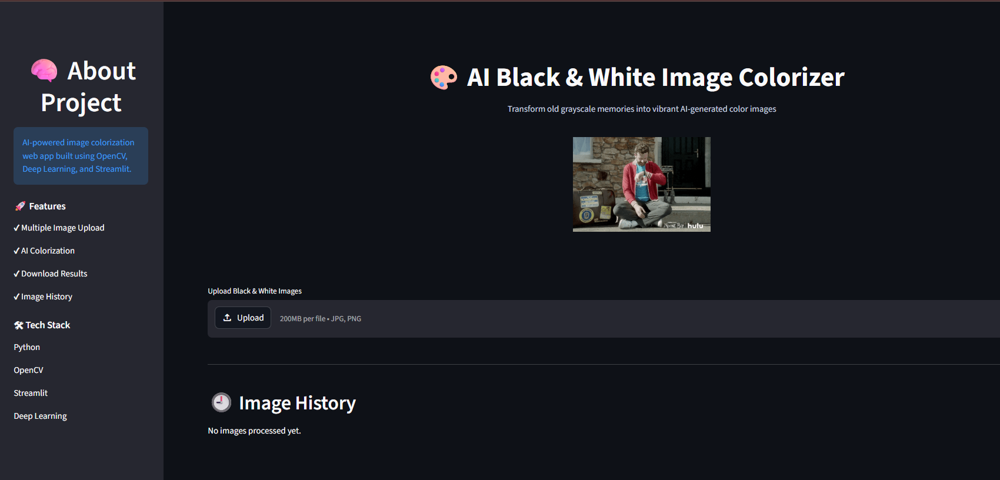
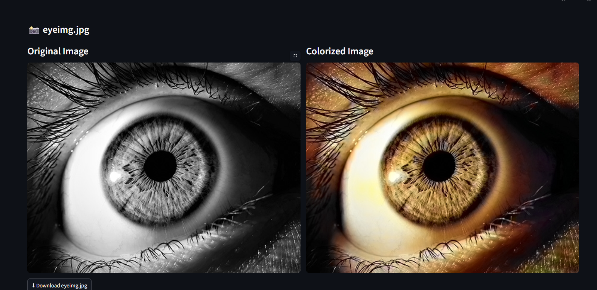

# 🎨 AI Image Colorizer

An AI-powered web application that converts black & white images into colorized images using Deep Learning and OpenCV.

## 🚀 Live Demo
https://ai-image-colorizer-khm65g9sd2q62rqm8u6wmg.streamlit.app/

---

## ✨ Features

- Upload single or multiple black & white images
- AI-based image colorization
- Download colorized images
- Image processing history
- Modern Streamlit web interface
- Responsive UI with animations

---

## 🛠️ Tech Stack

- Python
- OpenCV
- NumPy
- Streamlit
- Deep Learning (Caffe Model)

---

## 📂 Project Structure

```bash
AI-Image-Colorizer
│
├── app.py
├── main.py
├── README.md
├── requirements.txt
│
├── model/
│   ├── colorization_deploy_v2.prototxt
│   ├── colorization_release_v2.caffemodel
│   └── pts_in_hull.npy
│
├── images/
│   └── sample.jpg
│
├── screenshots/
│   ├── home.png
│   └── output.png
```

---

## ⚡ Installation

### Clone Repository

```bash
https://github.com/shrawanikapse09/AI-Image-Colorizer.git
```

### Go to Project Folder

```bash
cd AI-Image-Colorizer
```

### Install Dependencies

```bash
pip install -r requirements.txt
```

### Run App

```bash
python -m streamlit run app.py
```

---

## 🧠 How It Works

The application uses a pre-trained Deep Learning model based on the Caffe framework.

### Process:
1. Convert image from RGB to LAB color space
2. Extract L channel (light intensity)
3. Use AI model to predict ab color channels
4. Merge channels to generate final colorized image

---

## 📸 Screenshots

### Home Page



### Colorized Output



---

## 👩‍💻 Developer

Shrawani Kapse

---

## 🌟 Future Improvements

- Video colorization
- Webcam support
- Before/After comparison slider
- Dark mode themes
- Faster processing
- Cloud storage integration